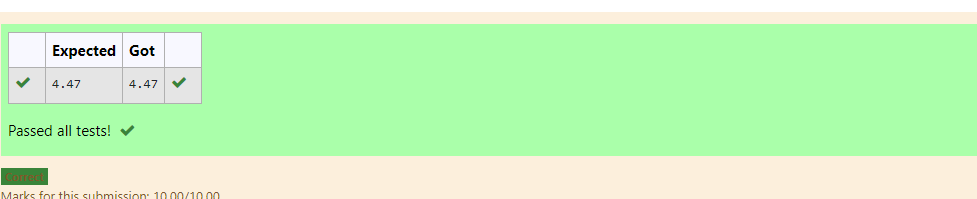

# DISTANCE-BETWEEN-TWO-POINTS

## AIM:
To write a python program to find the distance two 2 points
## ALGORITHM:
AIM:
To write a python program to find the distance two 2 points

ALGORITHM:
Step 1:
Create the program

Step 2:
Assign the values

Step 3:
Substitute the values in the distance formula formula

Step 4:
Display the values

Step 5:
End the program
### PROGRAM:
```
import math
x=[10,6]
y=[4,2]
dist=math.sqrt(((x[0]-x[1])**2)+((y[0]-y[1])**2))
print("{:.2f}".format(dist))
```
  


### OUTPUT:


### RESULT:
 A python program to find the distance two 2 points is completed